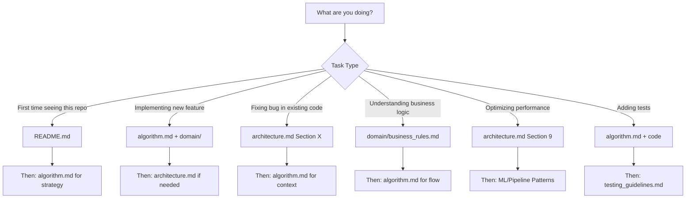

# CLAUDE.md

This file provides guidance to Claude Code (claude.ai/code) when working with code in this repository.

## Project Context

**Core pipeline operational** (scene detection, OCR, transcription). **Tasks 011-012 complete**: Running Order Detection (100% accuracy: 7/7 matches) + Match Boundary Detection (100% accuracy: ±1.27s avg error). **Working on** Task 012: Segment Classification (interludes, airtime calculation). Follow task-driven workflow in [docs/tasks/](docs/tasks/).

## What This Project Does

**MOTD Analyser** - Automated video analysis pipeline to objectively measure coverage bias in BBC's Match of the Day. Analyses running order, airtime distribution, and post-match analysis patterns from MOTD episodes (2025/26 season).

**User goal**: Settle football fan debates ("we're never on first!", "there's an agenda against my team") with data, not perception.

## Critical Warnings

**IMPORTANT**: This project uses task-driven development. Before implementing any feature:
1. Check if a task file exists in [docs/tasks/](docs/tasks/) or [docs/tasks/completed/](docs/tasks/completed/)
2. Check [docs/tasks/future/](docs/tasks/future/) for tentative tasks (YAGNI principle - only create when needed)
3. Never skip task validation checklists

**YOU MUST**:
- Always check video resolution with `ffprobe` before assuming 1920x1080 - BBC may change formats
- Activate virtual environment (`source venv/bin/activate`) before running any Python commands
- Check for cached results in `data/cache/{episode_id}/` before re-running expensive operations

**NEVER**:
- Run `openai-whisper` instead of `faster-whisper` (4x slower, wastes 6-12 mins per video)
- Skip caching checks - Whisper transcription costs 15-20 minutes per video (CPU-bound on M3 Pro)
- Commit files in `data/videos/` or `data/cache/` - they're gitignored for size reasons
- Use Tesseract for OCR (poor on sports graphics) - use EasyOCR
- Create deeply nested task structures (011a→011b-1→011b-2) - use sequential numbering (011-01, 011-02) instead
- Assume 1920x1080 resolution without verification (current episodes are 720p)
- Assume frame extraction is just 2-second intervals - it's HYBRID (scene changes + 2s intervals + deduplication)

## Repository Workflow

* Before starting a task or set of tasks, create a feature branch.
* git commit frequently when working on a task. Follow commit message format in [COMMIT_STYLE.md](COMMIT_STYLE.md).
* Always use squash merge when merging a feature branch into main.
* Always pause to ask the user before squash merging. Never assume the user wants Claude to squash merge before asking.

## Code Quality Guidelines

**Follow these guidelines when writing code:**

- [Python Style & Conventions](.claude/commands/references/python_guidelines.md)
- [Architecture & Design Patterns](.claude/commands/references/python_architecture_patterns.md)
- [ML/Pipeline Patterns](.claude/commands/references/ml_pipeline_patterns.md) **(CRITICAL - caching, GPU, etc.)**
- [Testing Guidelines](.claude/commands/references/testing_guidelines.md)
- [Code Quality Checklist](.claude/commands/references/code_quality_checklist.md)

## Domain Knowledge & Business Context

**Domain Documentation Hub** - [docs/domain/](docs/domain/)

Before implementing features, check the domain docs for business context:
- **[Domain Glossary](docs/domain/README.md)** - Terminology (FT Graphics, Running Order, Episode Manifest, Segment Types, etc.)
- **[Business Rules](docs/domain/business_rules.md)** - Validation logic, accuracy requirements, processing rules
- **[Visual Patterns](docs/domain/visual_patterns.md)** - Episode structure, timing patterns, ground truth data

**Why:** Sub-tasks reference these instead of duplicating context. Business logic documented alongside code.

**When writing sub-tasks:** Use [Sub-Task Template](.claude/commands/references/subtask_template.md) - includes Quick Context section linking to domain docs.

## Task-Driven Development Workflow

### Critical Pattern: Follow Tasks Sequentially

1. **Start here**: [docs/tasks/README.md](docs/tasks/README.md) - Overview of all 15 tasks
2. **Begin with**: [docs/tasks/001-environment-setup.md](docs/tasks/001-environment-setup.md)
3. **Work sequentially**: Tasks build on each other (001 → 002 → 003...)
4. **Validate at checkpoints**: Each task has a validation checklist - don't skip it
5. **Reference roadmap for code**: [docs/roadmap.md](docs/roadmap.md) contains detailed implementation examples

### Epic Tasks Require Splitting (Critical!)

**Tasks 008-015 are "epics"** - they combine multiple sub-tasks. Before implementing an epic:
- Read the epic file
- Split it into smaller, discrete tasks
- Implement incrementally
- Validate each sub-task

**Example**: Task 009 (OCR Implementation Epic) should be split into:
1. Implement OCR reader module
2. Implement team matcher
3. Create CLI command
4. Run on test video
5. Validate accuracy

Don't try to complete an epic in one session - split first, then execute.

## Technology Constraints (Critical)

### Use These Libraries (Not Alternatives)
- **Scene Detection**: PySceneDetect (ContentDetector) - *not raw OpenCV*
- **OCR**: EasyOCR (GPU-accelerated) - *not Tesseract* (poor on sports graphics)
- **Transcription**: **faster-whisper** - ***NOT* openai-whisper** (4x slower!)
- **Video Processing**: ffmpeg + opencv-python
- **Config**: PyYAML
- **Python**: 3.12.7

**Why faster-whisper is critical**: Standard openai-whisper takes 10-15 minutes per 90-minute video. faster-whisper does it in 3-4 minutes with identical accuracy. See [docs/tech-tradeoffs.md](docs/tech-tradeoffs.md) for benchmarks.

### If You Need to Pivot
See [docs/tech-tradeoffs.md](docs/tech-tradeoffs.md) for alternatives:
- EasyOCR too slow? → PaddleOCR (migration guide included)
- faster-whisper has issues? → Whisper API (cloud, costs $5-10 for 10 videos)
- Scene detection missing transitions? → Adjust threshold or try AdaptiveDetector

## Common Commands

```bash
# REQUIRED: Activate Python virtual environment before all Python commands
source venv/bin/activate

# Check video file properties (resolution, duration, codec)
ffprobe -v error -select_streams v:0 -show_entries stream=width,height,duration,codec_name -of default=noprint_wrappers=1 video.mp4

# Verify GPU availability for EasyOCR/faster-whisper
python -c "import torch; print(f'CUDA available: {torch.cuda.is_available()}')"

# Run tests for specific module
pytest tests/test_scene_detection.py -v

# Check cache status for episode
ls -lh data/cache/{episode_id}/

# Validate JSON output files
python -m json.tool data/output/analysis.json > /dev/null && echo "Valid JSON" || echo "Invalid JSON"

# Check if cache exists before running expensive operation
[ -f data/cache/{episode_id}/transcript.json ] && echo "Cache exists" || echo "Need to run transcription"
```

## British English Conventions

Use British spelling throughout codebase and docs:
- **Code & docs**: analyser (not analyzer), colour (not color), optimise (not optimize), visualisation (not visualization), recognise (not recognize)
- **Package name**: `motd` (not `motd-analyser` - avoid redundancy with repository name)
- **Comments**: "colour space" not "color space", "optimised for GPU" not "optimized for GPU"

## Configuration & Environment

### Premier League Teams - 2025/26 Season
File: [data/teams/premier_league_2025_26.json](data/teams/premier_league_2025_26.json) - Contains 20 teams with promoted: Burnley, Leeds United, Sunderland

### Video Resolution
**Always verify** with ffprobe before processing - do not assume 1920x1080. Adjust OCR regions in config if resolution differs.

### Caching Strategy
**CRITICAL**: Never re-run Whisper unnecessarily - it's the slowest stage (15-20 minutes per video on M3 Pro CPU). Always check `data/cache/{episode_id}/transcript.json` exists before transcribing. See [ML/Pipeline Patterns](.claude/commands/references/ml_pipeline_patterns.md) for caching implementation.

### Validation
Each task has validation checklists - see individual task files in [docs/tasks/](docs/tasks/) for success criteria.

## Where to Find Information

- **"What is this project?"** → [README.md](README.md) (overview, quick start, current results)
- **"How does the algorithm work?"** → [docs/algorithm.md](docs/algorithm.md) (plain-English strategy explanation)
- **"What does X mean?"** → [docs/domain/README.md](docs/domain/README.md) (domain glossary - FT graphics, running order, etc.)
- **"What are the business rules?"** → [docs/domain/business_rules.md](docs/domain/business_rules.md) (validation logic, accuracy requirements)
- **"How long do segments last?"** → [docs/domain/visual_patterns.md](docs/domain/visual_patterns.md) (episode structure, timings)
- **"How do I implement X?"** → [docs/roadmap.md](docs/roadmap.md) (detailed code examples)
- **"Why this library?"** → [docs/tech-tradeoffs.md](docs/tech-tradeoffs.md) (comparisons + alternatives)
- **"What's next?"** → [docs/tasks/README.md](docs/tasks/README.md) (task list + status)
- **"What should the output look like?"** → [docs/prd.md](docs/prd.md) section 3.4 (JSON schema)
- **"What's the big picture?"** → [docs/architecture.md](docs/architecture.md) (technical reference - OCR regions, Pydantic models, performance)
- **"How do I start?"** → [docs/tasks/001-environment-setup.md](docs/tasks/001-environment-setup.md) (first task)

## Documentation Navigation (For Claude Sessions)

**Quick reference - which doc to read first?**

This section helps stateless Claude sessions efficiently navigate documentation based on task type.

### By Task Type (Flowchart)



### Detailed Routing by Scenario

#### 🆕 "I'm new to this project"
**Read in order:**
1. [README.md](README.md) - Overview, quick start, current results (7/7 matches, 100% accuracy)
2. [docs/algorithm.md](docs/algorithm.md) - Understand the high-level strategy (venue + clustering + OCR)
3. [docs/architecture.md](docs/architecture.md) - Technical deep dive (only if implementing code)

**Time**: 10-15 mins reading

---

#### ⚙️ "I'm implementing a feature"
**Read in order:**
1. [docs/algorithm.md](docs/algorithm.md) - Understand high-level approach (e.g., Step 3 for match boundaries)
2. [docs/domain/](docs/domain/) - Business rules, visual patterns (if match boundary/segment related)
   - [business_rules.md](docs/domain/business_rules.md) - 5 core rules (FT validation, episode manifest, opponent inference)
   - [visual_patterns.md](docs/domain/visual_patterns.md) - Episode structure, timing patterns
3. [docs/architecture.md](docs/architecture.md) - Specific section only (e.g., Section 4.6 for match boundaries)
4. Existing code in `src/motd/` - Read implementation before modifying

**Skip**: Full architecture.md (too long), completed task files

---

#### 🐛 "I'm debugging an issue"
**Read in order:**
1. [docs/architecture.md](docs/architecture.md) - Technical reference for the failing stage
   - Section 4.2: OCR issues (FT graphics, scoreboards, opponent inference)
   - Section 4.5: Running order detection
   - Section 4.6: Match boundary detection (venue, clustering, team mention)
   - Section 9: Performance bottlenecks
2. [docs/algorithm.md](docs/algorithm.md) - Context on why it should work that way
3. [docs/domain/business_rules.md](docs/domain/business_rules.md) - Validation requirements (if validation failing)

**Focus**: Error messages, stack traces, validation failures

---

#### 📊 "I'm understanding business logic"
**Read in order:**
1. [docs/domain/business_rules.md](docs/domain/business_rules.md) - 5 core rules with source code links
   - Rule 1: FT graphic validation (≥1 team, score pattern, FT text)
   - Rule 2: Episode manifest constraint (search space reduction, confidence boost)
   - Rule 3: Opponent inference (70% recovery rate)
2. [docs/domain/visual_patterns.md](docs/domain/visual_patterns.md) - Episode structure, timing patterns
3. [docs/algorithm.md](docs/algorithm.md) - How rules are applied in practice (Step 2 for Rule 3 example)

**Skip**: architecture.md (too technical for business logic questions)

---

#### ⚡ "I'm optimizing performance"
**Read in order:**
1. [docs/architecture.md](docs/architecture.md) Section 9 - Performance considerations
   - Processing times: 45-55 mins per episode (transcription slowest at 15-20 mins)
   - Caching impact (second run <1 min)
   - Hybrid frame extraction (2,600 frames, 78% increase)
2. [.claude/commands/references/ml_pipeline_patterns.md](.claude/commands/references/ml_pipeline_patterns.md) - Caching strategies

**Focus**: Bottleneck analysis (transcription CPU-bound, waiting for CTranslate2 MPS support)

---

#### ✅ "I'm adding tests"
**Read in order:**
1. [docs/algorithm.md](docs/algorithm.md) - Understand expected behavior (e.g., Step 3 for boundary detection)
2. Existing code in `src/motd/` - Read implementation to test
3. [.claude/commands/references/testing_guidelines.md](.claude/commands/references/testing_guidelines.md) - Testing patterns

**Current tests**: 46/46 passing (Task 012)

---

### Context Budget Optimization

**Limited token window?** Read in priority order:

#### High Priority (Always Read)
- **CLAUDE.md** (this file) - Critical warnings, technology constraints
- **Relevant domain doc** (e.g., business_rules.md for validation work)
- **Specific architecture.md section** (not the whole file!)

#### Medium Priority (Read if Budget Allows)
- **docs/algorithm.md** (for strategy understanding)
- **README.md** (for project overview)

#### Low Priority (Only if Needed)
- **Full architecture.md** (7,000+ tokens - read specific sections instead)
- **Historical task files** in docs/tasks/completed/
- **Tech tradeoffs** (unless choosing libraries)

**Pro tip**: Use Ctrl+F to jump to specific sections in architecture.md instead of reading the entire file.

---

### Common Pitfalls (Check Before Starting!)

**Before diving into docs, check if your task involves these common misconceptions:**

| Misconception | Reality | Read This |
|---------------|---------|-----------|
| "Frame extraction is just 2-second intervals" | **HYBRID** (scene changes + 2s intervals + deduplication) | [architecture.md#4.2](docs/architecture.md#42-ocr-processing) |
| "Scoreboards are the main OCR target" | **FT graphics PRIMARY** (90-95% accuracy), scoreboards BACKUP (75-85%) | [algorithm.md Step 2](docs/algorithm.md#step-2-running-order-detection-which-teams-in-which-order) |
| "Transcription takes 3-4 minutes" | **15-20 minutes** (CPU-bound on M3 Pro, no MPS support yet) | [architecture.md#9](docs/architecture.md#9-performance-considerations) |
| "Match boundaries use one strategy" | **THREE strategies** (venue + clustering + team mention), all implemented | [algorithm.md Step 3](docs/algorithm.md#step-3-match-boundary-detection-when-does-each-match-start) |
| "Clustering is theoretical" | **Fully implemented** (7/7 matches, 100% agreement with venue) | [architecture.md#4.6](docs/architecture.md#46-match-boundary-detection) |
| "OCR works on 1080p video" | **720p coordinates** in config (verify with ffprobe) | [architecture.md#4.2](docs/architecture.md#42-ocr-processing) |

---

**Remember**: This is a marathon, not a sprint. The planning is done. Now execute methodically, one task at a time, with validation at every step.

Up the Addicks! ⚽🔴⚪
