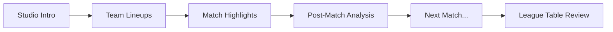

# MOTD Analyser

> **Automated analysis pipeline to objectively measure coverage bias in BBC's Match of the Day**

[](https://www.python.org/downloads/)
[](LICENSE)
[]()

## The Problem

Football fans love to complain about Match of the Day coverage:
- *"My team is never shown first!"*
- *"There's an agenda against us!"*
- *"We always get less airtime than the big clubs!"*

But is it perception or reality? This project settles the debate with **data, not feelings**.

## What This Does

The MOTD Analyser processes Match of the Day episodes to extract:

1. **Running Order** - Which teams are shown first, second, third, etc.
2. **Segment Boundaries** - Where studio intro, highlights and post-match analysis begin and end
3. **Airtime Distribution** - How much coverage each team receives

## How It Works

Four cached stages, orchestrated by `motd run`:

| Stage | What it does |
|-------|--------------|
| **Download** | Pulls the episode from BBC iPlayer via yt-dlp (optional — skip it with a local file) |
| **Transcribe** | Parses the broadcast subtitles iPlayer publishes as EBU-TT/TTML into a timestamped `Transcript` |
| **Analyse** | Sends transcript + the gameweek's fixtures to the Claude API, resolves the reply into a validated `EpisodeAnalysis` |
| **Publish** | Uploads the analysis JSON to Cloudflare R2 |

The transcript comes from iPlayer's own subtitles rather than speech-to-text: they carry
millisecond timings and colour-coded speaker changes for free, without the 15-20 minute
Whisper pass. iPlayer only serves them inside an episode's availability window, so they are
fetched alongside the video rather than at transcribe time.

Segment detection is **LLM-based, not rule-based**; rule-based detection was tried first and
struggled with nuanced transitions. Claude never invents an identifier, though: it is handed
the gameweek's fixtures as an enumerated candidate list and constrained by a JSON schema to
echo back one of those exact labels, which the analyser resolves to a fixture in code. Its
only judgements are which candidates got screen time, in what order, and when.

The candidate window is the gameweek rather than the broadcast date, because an episode shows
more than that day's matches — a Friday game held over to Saturday's show, or a round-up of
Saturday action on Sunday. Whether a match got a full package or a brief second look is
derived later from its duration and earlier episodes, not recorded here.

### Episode Structure

Every Match of the Day episode follows a predictable pattern:


```mermaid
graph LR
    A[Studio Intro] --> B[Team Lineups]
    B --> C[Match Highlights]
    C --> D[Post-Match Analysis]
    D --> E[Next Match...]
    E --> F[League Table Review]
```

## Quick Start

### Prerequisites

- uv (`brew install uv`)
- yt-dlp (`brew install yt-dlp`) — download and subtitle fetching
- An `ANTHROPIC_API_KEY` — the analysis backend
- Cloudflare R2 credentials for publishing: `R2_BUCKET`, `R2_ACCOUNT_ID`, `R2_ACCESS_KEY_ID`, `R2_SECRET_ACCESS_KEY`

Copy `.env.template` to `.env` and fill it in. Nothing loads that file automatically —
export it with `set -a; source .env; set +a`, or use direnv.

The standalone speech-to-text path additionally needs ffmpeg and `OPENAI_API_KEY`.

### Installation

```bash
# Clone repository
git clone https://github.com/mbd0910/motd-video-analyser.git
cd motd-video-analyser

# Install dependencies (uv creates .venv and fetches Python 3.14 itself)
uv sync
```

Prefix commands with `uv run`, or activate the environment once with
`source .venv/bin/activate`.

### Usage

Run the whole pipeline from an iPlayer URL:

```bash
python -m motd run --url https://www.bbc.co.uk/iplayer/episode/... --date 2026-08-22
```

Or from a video you already have:

```bash
python -m motd run data/videos/motd_2026-27_2026-08-22.mp4
```

Options: `--episode-id ID`, `--skip-to {transcribe,analyse,publish}` (requires `--episode-id`),
`--force` (ignore cache and re-run).

**Individual stages:**
- `python -m motd download URL_OR_ID BROADCAST_DATE` - fetch the video
- `python -m motd subtitles URL_OR_ID BROADCAST_DATE` - fetch subtitles only
- `python -m motd transcribe VIDEO_PATH` - speech-to-text via the OpenAI Whisper API
- `python -m motd analyse EPISODE_ID` - run the LLM analysis
- `python -m motd publish EPISODE_ID` - upload to R2
- `python -m motd fixtures sync` - refresh the season's fixtures from the FPL API

Use `--help` on any command for full options.

### Example Output

```json
{
  "episode_id": "motd_2026-27_2026-08-22",
  "broadcast_date": "2026-08-22",
  "season": "2026-27",
  "gameweek": 1,
  "matches": [
    {
      "fpl_code": 2645198,
      "order": 1,
      "segments": {
        "studio_intro": {"start": "02:05", "end": "03:07"},
        "highlights": {"start": "03:07", "end": "08:43"},
        "studio_analysis": {"start": "08:43", "end": "12:20"}
      },
      "notes": null
    }
  ],
  "provenance": {
    "model": "claude-opus-5",
    "prompt_version": "3",
    "analysed_at": "2026-08-24T21:14:03Z",
    "candidate_fpl_codes": [2645195, 2645198, 2645197, 2645199, 2645200, 2645196],
    "input_tokens": 31204,
    "output_tokens": 812,
    "walkthrough": "00:21-01:14 studio set-up for Hull City v Manchester United..."
  }
}
```

Team names, venue and score are not repeated here — `fpl_code` joins to the fixture that
holds them. `candidate_fpl_codes` records what the model was allowed to choose from, which
is the one input that cannot be reconstructed later once fixtures are re-synced.

The Pydantic models in `src/motd/models.py` are the authoritative contract.

## Project Structure

```
motd-video-analyser/
├── src/motd/                    # Main package (see CLAUDE.md for the module map)
├── data/
│   ├── teams/                   # Premier League club directory
│   ├── fixtures/                # Season fixtures from the FPL API
│   ├── analysis/                # Analysis results
│   ├── videos/                  # Downloaded episodes (gitignored)
│   └── cache/                   # Pipeline cache (gitignored)
└── tests/                       # pytest test suite
```

## Development Workflow

This project uses **GitHub Issues** for tracking work:

1. Check [GitHub Issues](https://github.com/mbd0910/motd-video-analyser/issues) for current work
2. Use feature branches: `feature/issue-{number}-{slug}`

Run the tests with `uv run pytest`.

## Contributing

This is a personal project, but suggestions and improvements are welcome! Please:

1. Check existing issues before creating new ones
2. Follow the British English convention (analyser, not analyzer)
3. Include tests for new features

## License

MIT License - see [LICENSE](LICENSE) for details

---

**Up the Addicks!** ⚽🔴⚪

*Objectively measuring Match of the Day coverage, one episode at a time.*
