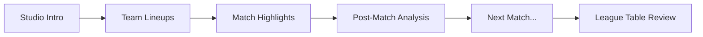

# MOTD Analyser

> **Automated video analysis pipeline to objectively measure coverage bias in BBC's Match of the Day**

[](https://www.python.org/downloads/)
[](LICENSE)
[]()

## The Problem

Football fans love to complain about Match of the Day coverage:
- *"My team is never shown first!"*
- *"There's an agenda against us!"*
- *"We always get less airtime than the big clubs!"*

But is it perception or reality? This project settles the debate with **data, not feelings**.

## What This Does

The MOTD Analyser automatically processes Match of the Day episodes (2025/26 season) to extract:

1. **Running Order** - Which teams are shown first, second, third, etc.
2. **Match Boundaries** - When each match segment starts and ends (studio intro → highlights → post-match analysis)
3. **Airtime Distribution** - How much coverage each team receives
4. **Segment Classification** - Studio analysis vs highlights vs interviews

**Current Status**: ✅ Running order detection (100% accuracy), ✅ Match boundary detection (100% accuracy), 🔄 Segment classification in progress

## How It Works

### The Workflow

The analyser uses an **LLM-based workflow** for segment detection:

1. **Run automated pipeline** - Extract scenes, detect teams via OCR, transcribe audio
2. **Generate LLM prompt** - Combines transcript + advisory hints (OCR detections, fixtures)
3. **Claude analysis** - Paste prompt into Claude web UI, receive structured JSON
4. **Save results** - Store analysis.json in source control

The LLM approach is preferred over the rule-based detection we tried first, which struggled with nuanced segment boundaries.

### What the Pipeline Produces

The automated stages provide **advisory hints** to improve LLM accuracy:

- **Scene Detection** - Frame extraction (~2,600 frames per episode)
- **OCR** - FT graphics and scoreboard timestamps (anchor segment boundaries)
- **Transcription** - Word-level timestamps for the full episode
- **Fixtures** - Expected matches for the broadcast date

### Episode Structure

Every Match of the Day episode follows a predictable pattern:


```mermaid
graph LR
    A[Studio Intro] --> B[Team Lineups]
    B --> C[Match Highlights]
    C --> D[Post-Match Analysis]
    D --> E[Next Match...]
    E --> F[League Table Review]
```

The LLM identifies these segments from the transcript, using OCR hints to anchor timestamps.

## Technology Stack

| Component | Library | Why This One? |
|-----------|---------|---------------|
| Scene Detection | PySceneDetect | Content-based detection, reliable for sports broadcasts |
| OCR | EasyOCR | GPU-accelerated, 90-95% accuracy on sports graphics |
| Transcription | faster-whisper | 4x faster than openai-whisper (3-4 mins vs 12-15 mins per video) |
| Video Processing | ffmpeg + opencv-python | Industry standard, robust |
| Fuzzy Matching | rapidfuzz | Team name variants, stadium aliases |
| Type Safety | Pydantic | Runtime validation, clear data contracts |

See [docs/tech-tradeoffs.md](docs/tech-tradeoffs.md) for detailed comparisons and alternatives.

## Quick Start

### Prerequisites

- Python 3.12.7
- ffmpeg installed (`brew install ffmpeg` on macOS)
- GPU recommended (but not required) for faster OCR/transcription

### Installation

```bash
# Clone repository
git clone https://github.com/yourusername/motd-video-analyser.git
cd motd-video-analyser

# Create virtual environment
python3.12 -m venv venv
source venv/bin/activate

# Install dependencies
pip install -r requirements.txt
```

### Usage

#### Full Workflow

```bash
# 1. Activate virtual environment (always required)
source venv/bin/activate

# 2. Run automated pipeline (extracts scenes, OCR, transcript)
python -m motd run data/videos/motd_2025-26_2025-11-01.mp4

# 3. Generate LLM prompt
python -m motd generate-llm-prompt motd_2025-26_2025-11-01

# 4. Copy prompt and paste into Claude web UI
cat data/cache/motd_2025-26_2025-11-01/transcript_for_llm.txt | pbcopy
# → Paste into https://claude.ai → Claude returns JSON

# 5. Save Claude's JSON response
# → Save to data/analysis/motd_2025-26_2025-11-01/analysis.json
```

**Pipeline Performance** (M3 Pro, 90-minute episode):
- **First run**: ~30-35 minutes total
  - Stage 1 (scenes): ~5-8 minutes
  - Stage 2 (OCR): ~8-12 minutes
  - Stage 3 (transcription): ~15-20 minutes (CPU-bound)
- **Cached run**: <1 minute (all stages skipped)

#### LLM Prompt Options

```bash
# Standard prompt (with OCR hints)
python -m motd generate-llm-prompt motd_2025-26_2025-11-22

# Without OCR hints
python -m motd generate-llm-prompt motd_2025-26_2025-11-22 --no-hints

# Force overwrite existing prompt
python -m motd generate-llm-prompt motd_2025-26_2025-11-22 --force
```

**Output schema** (what Claude returns):
- Episode segments: intro, league_table, next_motd_promo, outro
- Match segments: studio_intro, lineups, highlights, post_match_interviews, studio_analysis
- All timestamps have independent start/end (either can be null)

See [analysis_schema.md](docs/domain/analysis_schema.md) for the complete JSON schema.

#### Individual Pipeline Stages

Run individual stages for debugging or development:

```bash
# Scene Detection
python -m motd detect-scenes data/videos/motd_2025-26_2025-11-01.mp4

# Team Detection (OCR)
python -m motd extract-teams \
  --scenes data/cache/motd_2025-26_2025-11-01/scenes.json \
  --episode-id motd_2025-26_2025-11-01

# Transcription
python -m motd transcribe data/videos/motd_2025-26_2025-11-01.mp4
```

### Example Output

```json
{
  "episode_id": "motd_2025-26_2025-11-01",
  "running_order": [
    {
      "position": 1,
      "home_team": "Liverpool",
      "away_team": "Aston Villa",
      "match_start": 125.4,
      "highlights_start": 186.8,
      "highlights_end": 523.2,
      "confidence": 1.0,
      "validation_status": "validated"
    }
  ]
}
```

## Project Structure

```
motd-video-analyser/
├── src/motd/                    # Main package
│   ├── scene_detection/         # PySceneDetect integration
│   ├── ocr/                     # EasyOCR + team matching
│   ├── transcription/           # faster-whisper integration
│   ├── llm/                     # LLM prompt generation
│   └── pipeline/                # Pydantic models
├── data/
│   ├── teams/                   # Premier League teams 2025/26
│   ├── fixtures/                # Match schedules
│   ├── episodes/                # Episode manifests
│   ├── analysis/                # LLM analysis results (committed)
│   └── cache/                   # Pipeline cache (gitignored)
├── docs/
│   ├── tasks/                   # Task-driven development workflow
│   ├── domain/                  # Business rules + visual patterns
│   ├── architecture.md          # Technical reference
│   └── algorithm.md             # LLM workflow overview
└── tests/                       # pytest test suite
```

## Documentation

- **[algorithm.md](docs/algorithm.md)** - LLM-based workflow overview (start here!)
- **[analysis_schema.md](docs/domain/analysis_schema.md)** - JSON schema for LLM output
- **[architecture.md](docs/architecture.md)** - Technical reference (pipeline stages)
- **[Domain Glossary](docs/domain/README.md)** - FT graphics, running order, episode structure
- **[Business Rules](docs/domain/business_rules.md)** - Validation rules for OCR hints
- **[Visual Patterns](docs/domain/visual_patterns.md)** - Episode timing patterns
- **[Tech Tradeoffs](docs/tech-tradeoffs.md)** - Library comparisons and alternatives

## Current Results

**Test Episode**: motd_2025-26_2025-11-01 (7 matches, 84 minutes)

| Metric | Result |
|--------|--------|
| OCR Accuracy (FT Graphics) | 90-95% |
| Transcription Time (CPU) | ~15-20 minutes |
| LLM Prompt Generation | ~22k tokens |
| Tests Passing | 46/46 ✅ |

## Development Workflow

This project uses **GitHub Issues** for tracking work:

1. Check [GitHub Issues](https://github.com/mbd0910/motd-video-analyser/issues) for current work
2. Follow [COMMIT_STYLE.md](COMMIT_STYLE.md) for git conventions
3. Use feature branches: `feature/issue-{number}-{slug}`

Historical tasks (001-012) are archived in [docs/tasks/completed/](docs/tasks/completed/).

## Progress

### Completed ✅
- **Phase 0**: Project Setup (Tasks 001-005)
- **Phase 1**: Scene Detection (Tasks 006-008)
- **Phase 2**: OCR & Team Detection (Task 009)
- **Phase 3**: Audio Transcription (Task 010)
- **Phase 4**: Running Order Detection (Task 011)
- **Phase 4.5**: Match Boundary Detection (Task 012)

### In Progress 🔄
See [GitHub Issues](https://github.com/mbd0910/motd-video-analyser/issues) for current work items.

## Contributing

This is a personal project, but suggestions and improvements are welcome! Please:

1. Check existing issues before creating new ones
2. Follow the British English convention (analyser, not analyzer)
3. Include tests for new features
4. Follow [Python Style Guidelines](.claude/commands/references/python_guidelines.md)

## License

MIT License - see [LICENSE](LICENSE) for details

## Acknowledgements

Built with:
- [PySceneDetect](https://github.com/Breakthrough/PySceneDetect) for scene detection
- [EasyOCR](https://github.com/JaidedAI/EasyOCR) for optical character recognition
- [faster-whisper](https://github.com/SYSTRAN/faster-whisper) for audio transcription
- [rapidfuzz](https://github.com/maxbachmann/RapidFuzz) for fuzzy string matching

---

**Up the Addicks!** ⚽🔴⚪

*Objectively measuring Match of the Day coverage, one episode at a time.*
