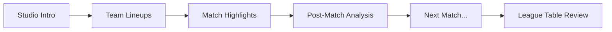

# MOTD Analyser

> **Automated video analysis pipeline to objectively measure coverage bias in BBC's Match of the Day**

[](https://www.python.org/downloads/)
[](LICENSE)
[]()

## The Problem

Football fans love to complain about Match of the Day coverage:
- *"My team is never shown first!"*
- *"There's an agenda against us!"*
- *"We always get less airtime than the big clubs!"*

But is it perception or reality? This project settles the debate with **data, not feelings**.

## What This Does

The MOTD Analyser automatically processes Match of the Day episodes (2025/26 season) to extract:

1. **Running Order** - Which teams are shown first, second, third, etc.
2. **Match Boundaries** - When each match segment starts and ends (studio intro → highlights → post-match analysis)
3. **Airtime Distribution** - How much coverage each team receives
4. **Segment Classification** - Studio analysis vs highlights vs interviews

**Current Status**: ✅ Running order detection (100% accuracy), ✅ Match boundary detection (100% accuracy), 🔄 Segment classification in progress

## How It Works

### Episode Structure

Every Match of the Day episode follows a predictable pattern:



### Multi-Strategy Detection

The pipeline uses **three complementary strategies** to detect match boundaries with 100% accuracy:

#### 1. Visual Analysis (OCR)
- **FT Graphics** (primary): Full-time score graphics in lower-middle screen (90-95% accuracy)
- **Scoreboards** (backup): Top-left scoreboards during highlights (75-85% accuracy)
- **Hybrid Frame Extraction**: Combines scene change detection + 2-second interval sampling

#### 2. Venue Detection
- Searches backward from highlights start for stadium mentions ("Anfield", "Emirates", etc.)
- Fuzzy matches against known Premier League venues
- Validates against expected fixtures
- **Results**: 7/7 matches detected, ±1.27s average error

#### 3. Temporal Clustering
- Analyses when teams are mentioned together in the audio transcript
- Identifies dense clusters of co-mentions (sliding 20-second windows)
- Returns earliest mention in densest cluster
- **Results**: 7/7 matches, 100% agreement with venue strategy

### Cross-Validation

All three strategies run independently, then cross-validate:
- ≤10s difference: ✅ Validated (confidence 1.0)
- ≤30s difference: ⚠️ Minor discrepancy (confidence 0.8)
- \>30s difference: ❌ Manual review required (confidence 0.5)

**Current validation rate**: 7/7 matches with 0.0s difference between venue and clustering strategies.

### Fixture-Based Intelligence

The pipeline doesn't guess - it uses **episode manifests** with expected fixtures:

```json
{
  "episode_id": "motd_2025-26_2025-11-01",
  "expected_matches": [
    "2025-11-01-liverpool-astonvilla",
    "2025-11-01-burnley-arsenal"
  ]
}
```

**Benefits**:
- 30% search space reduction (14 teams vs 20 in Premier League)
- +10% confidence boost for expected teams
- False positive filtering (rejects replays, promos, rival mentions)
- Opponent inference (if OCR detects only 1 team, infer the other from fixtures)

## Technology Stack

| Component | Library | Why This One? |
|-----------|---------|---------------|
| Scene Detection | PySceneDetect | Content-based detection, reliable for sports broadcasts |
| OCR | EasyOCR | GPU-accelerated, 90-95% accuracy on sports graphics |
| Transcription | faster-whisper | 4x faster than openai-whisper (3-4 mins vs 12-15 mins per video) |
| Video Processing | ffmpeg + opencv-python | Industry standard, robust |
| Fuzzy Matching | rapidfuzz | Team name variants, stadium aliases |
| Type Safety | Pydantic | Runtime validation, clear data contracts |

See [docs/tech-tradeoffs.md](docs/tech-tradeoffs.md) for detailed comparisons and alternatives.

## Quick Start

### Prerequisites

- Python 3.12.7
- ffmpeg installed (`brew install ffmpeg` on macOS)
- GPU recommended (but not required) for faster OCR/transcription

### Installation

```bash
# Clone repository
git clone https://github.com/yourusername/motd-video-analyser.git
cd motd-video-analyser

# Create virtual environment
python3.12 -m venv venv
source venv/bin/activate

# Install dependencies
pip install -r requirements.txt
```

### Usage

```bash
# Activate virtual environment (always required)
source venv/bin/activate

# Extract frames and detect teams via OCR
python -m motd extract-teams data/videos/motd_2025-26_2025-11-01.mp4

# Transcribe audio to text with word-level timestamps
python -m motd transcribe data/videos/motd_2025-26_2025-11-01.mp4

# Detect running order (which teams appear in which order)
python -m motd detect-running-order data/videos/motd_2025-26_2025-11-01.mp4

# Full pipeline (coming soon in Task 012)
python -m motd process data/videos/motd_2025-26_2025-11-01.mp4
```

### Example Output

```json
{
  "episode_id": "motd_2025-26_2025-11-01",
  "running_order": [
    {
      "position": 1,
      "home_team": "Liverpool",
      "away_team": "Aston Villa",
      "match_start": 125.4,
      "highlights_start": 186.8,
      "highlights_end": 523.2,
      "confidence": 1.0,
      "validation_status": "validated"
    }
  ]
}
```

## Project Structure

```
motd-video-analyser/
├── src/motd/                    # Main package
│   ├── scene_detection/         # PySceneDetect integration
│   ├── ocr/                     # EasyOCR + team matching
│   ├── transcription/           # faster-whisper integration
│   ├── analysis/                # Running order + boundary detection
│   └── pipeline/                # Pydantic models
├── data/
│   ├── teams/                   # Premier League teams 2025/26
│   ├── fixtures/                # Match schedules
│   ├── venues/                  # Stadium names + aliases
│   ├── episodes/                # Episode manifests
│   └── cache/                   # Cached results (gitignored)
├── docs/
│   ├── tasks/                   # Task-driven development workflow
│   ├── domain/                  # Business rules + visual patterns
│   ├── architecture.md          # Technical reference
│   └── algorithm.md             # High-level strategy explanation
└── tests/                       # pytest test suite
```

## Documentation

- **[algorithm.md](docs/algorithm.md)** - High-level strategy explanation (start here!)
- **[architecture.md](docs/architecture.md)** - Technical reference documentation
- **[Domain Glossary](docs/domain/README.md)** - FT graphics, running order, episode structure
- **[Business Rules](docs/domain/business_rules.md)** - Validation logic, accuracy requirements
- **[Visual Patterns](docs/domain/visual_patterns.md)** - Episode timing patterns, ground truth data
- **[Tech Tradeoffs](docs/tech-tradeoffs.md)** - Library comparisons and alternatives
- **[Tasks](docs/tasks/README.md)** - Development roadmap (001-015)

## Current Results

**Test Episode**: motd_2025-26_2025-11-01 (7 matches, 84 minutes)

| Metric | Result |
|--------|--------|
| Running Order Accuracy | 7/7 matches (100%) |
| Match Boundary Detection | 7/7 matches (100%) |
| Average Timing Error | ±1.27 seconds |
| Cross-Validation Agreement | 7/7 matches (0.0s difference) |
| OCR Accuracy (FT Graphics) | 90-95% |
| Transcription Time (CPU) | ~15-20 minutes |
| Tests Passing | 46/46 ✅ |

## Development Workflow

This project uses **task-driven development**:

1. Check [docs/tasks/BACKLOG.md](docs/tasks/BACKLOG.md) for current status
2. Work sequentially through tasks (001 → 002 → 003...)
3. Each task has validation checkpoints - don't skip them
4. Follow [COMMIT_STYLE.md](COMMIT_STYLE.md) for git conventions
5. Use feature branches: `feature/task-{number}-{slug}`

See [.claude/commands/task-workflow.md](.claude/commands/task-workflow.md) for the full workflow.

## Roadmap

- [x] **Phase 0**: Project Setup (Tasks 001-005)
- [x] **Phase 1**: Scene Detection (Tasks 006-008)
- [x] **Phase 2**: OCR & Team Detection (Task 009)
- [x] **Phase 3**: Audio Transcription (Task 010)
- [x] **Phase 4**: Running Order Detection (Task 011a-011b)
- [x] **Phase 4**: Match Boundary Detection (Task 012-01)
- [ ] **Phase 4**: Segment Classification (Task 012 - in progress)
- [ ] **Phase 5**: Production CLI (Task 013)
- [ ] **Phase 6**: Batch Processing (Task 014)
- [ ] **Phase 7**: Final Documentation (Task 015)

**Estimated completion**: 2-3 weeks of active development

## Contributing

This is a personal project, but suggestions and improvements are welcome! Please:

1. Check existing issues before creating new ones
2. Follow the British English convention (analyser, not analyzer)
3. Include tests for new features
4. Follow [Python Style Guidelines](.claude/commands/references/python_guidelines.md)

## License

MIT License - see [LICENSE](LICENSE) for details

## Acknowledgements

Built with:
- [PySceneDetect](https://github.com/Breakthrough/PySceneDetect) for scene detection
- [EasyOCR](https://github.com/JaidedAI/EasyOCR) for optical character recognition
- [faster-whisper](https://github.com/SYSTRAN/faster-whisper) for audio transcription
- [rapidfuzz](https://github.com/maxbachmann/RapidFuzz) for fuzzy string matching

---

**Up the Addicks!** ⚽🔴⚪

*Objectively measuring Match of the Day coverage, one episode at a time.*
