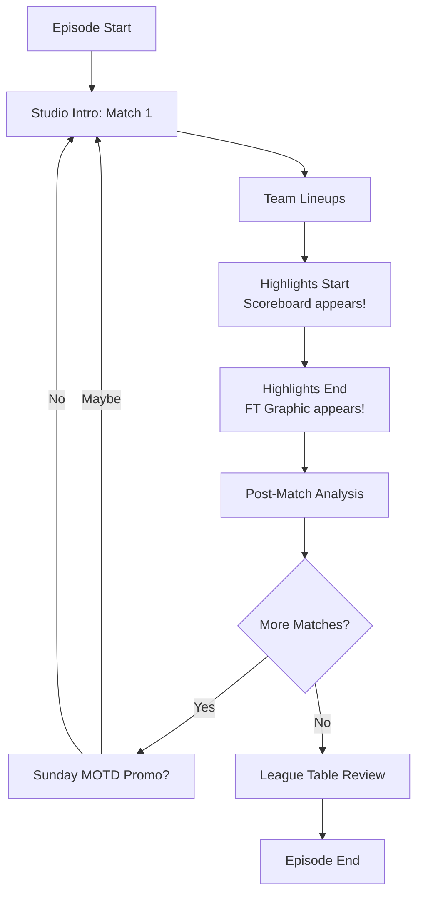

# MOTD Analyser Algorithm - High-Level Strategy

> **Plain-English explanation of how the MOTD Analyser works**
>
> This document bridges the gap between [README.md](../README.md) (what/why) and [architecture.md](architecture.md) (technical details).

---

## The Big Picture

Match of the Day episodes follow a **predictable pattern**. Every Saturday night, the same structure:

1. **Studio intro** - Host introduces the first match
2. **Team lineups** - Formations and starting XIs
3. **Match highlights** - Goals, key moments (scoreboard appears!)
4. **Post-match** - Interviews and pundit analysis
5. **Repeat** for next match...
6. **League table review** - End of episode

Our algorithm exploits this predictability using **multi-strategy detection** with **cross-validation**.

---

## Episode Structure Flow



---

## Step 1: Preprocessing (Extracting Data from Video)

Before we can detect anything, we need to extract data from the video file.

### 1.1 Hybrid Frame Extraction

**Goal**: Get representative snapshots of the video without storing every single frame.

**Two-phase strategy**:
1. **Scene change detection** (PySceneDetect) - extracts frames when the picture changes significantly (e.g., studio → highlights)
2. **2-second interval sampling** - extracts frames every 2 seconds regardless of scene changes
3. **Deduplication** - removes frames within 1 second of each other

**Result**: ~2,600 frames for a 90-minute episode

**Why hybrid?** Scene detection alone misses static graphics (FT graphics can appear without scene change). Intervals alone waste storage on unchanging scenes. Hybrid gives best of both worlds.

### 1.2 Optical Character Recognition (OCR)

**Goal**: Read text from three specific regions of each frame.

**Three regions** (720p video):
1. **Lower-middle** (PRIMARY) - FT graphics (e.g., "Liverpool 2-0 Aston Villa FT")
2. **Top-left** (BACKUP) - Live scoreboards during highlights
3. **Bottom-right** (VALIDATION ONLY) - Formation graphics for manual verification

**Why lower-middle is PRIMARY?** FT graphics have:
- Larger, bolder text (easier to read)
- No motion blur (static graphic)
- Clear "FT" marker (easy to validate)
- 90-95% OCR accuracy vs 75-85% for scoreboards

**What we detect**:
- Team names (e.g., "Liverpool", "Aston Villa")
- Scores (e.g., "2-0", "3 | 1")
- "FT" text (full time marker)

### 1.3 Audio Transcription

**Goal**: Convert speech to text with precise timestamps.

**Process**:
1. Extract audio track from video (ffmpeg)
2. Run faster-whisper (large-v3 model) for transcription
3. Generate word-level timestamps (e.g., "Anfield" at 125.4 seconds)

**Time**: 15-20 minutes per 90-minute episode (CPU-bound on M3 Pro)

**Output**: Full transcript with every word timestamped to 0.1-second precision.

---

## Step 2: Running Order Detection (Which Teams in Which Order?)

**Goal**: Figure out Match 1 is Liverpool vs Aston Villa, Match 2 is Burnley vs Arsenal, etc.

### 2.1 The Fixture Hint

We **don't guess** which teams might appear. We know the episode date (e.g., 2025-11-01), so we load the **episode manifest**:

```json
{
  "episode_id": "motd_2025-26_2025-11-01",
  "expected_matches": [
    "2025-11-01-liverpool-astonvilla",
    "2025-11-01-burnley-arsenal",
    ...7 matches total
  ]
}
```

**Benefits**:
- Search space: 14 teams (7 matches) instead of 20 Premier League teams
- Filters false positives (e.g., "Manchester United" mentioned as a rival)
- Enables opponent inference (see next section)

### 2.2 OCR Detection Strategy

**Primary target**: FT graphics (lower-middle of screen)

**Validation** (must pass ALL three):
1. ≥1 team detected (allows opponent inference)
2. Score pattern present: `2-0`, `3 | 1`, `1-1`, etc.
3. "FT" text present: [FT, FULL TIME, FULL-TIME, FULLTIME]

**Example**:
- Frame 329: OCR reads "Liverpool 2 0 FT"
- Detects: Liverpool (✓), Score "2 0" (✓), "FT" (✓)
- **But**: Only 1 team detected (Aston Villa's text too faint to read)

### 2.3 Opponent Inference (Rule 3)

**Problem**: OCR sometimes misses one team name (non-bold text, motion blur).

**Solution**: If we detect 1 team + valid FT graphic → infer opponent from fixtures.

**Example (Frame 329)**:
1. OCR detects: "Liverpool" only
2. Check episode manifest: Liverpool vs Aston Villa (home match)
3. **Infer**: Aston Villa is the opponent
4. Confidence: 0.75 (lower than OCR-detected, but better than nothing)
5. Mark as `inferred_from_fixture` for transparency

**Impact**: Recovers ~70% of single-team FT graphics.

### 2.4 Ordering Matches

**Process**:
1. Collect all valid OCR detections (FT graphics + scoreboards + inferred)
2. Group by fixture (e.g., all "Liverpool vs Aston Villa" detections)
3. Find **earliest timestamp** for each match
4. Sort matches by earliest detection
5. Assign running order position (1, 2, 3...)

**Result**: Liverpool vs Aston Villa first detected at 186.8s → Match 1 ✅

---

## Step 3: Match Boundary Detection (When Does Each Match Start?)

**Goal**: Find the precise timestamp when the host starts talking about a match.

**Challenge**: The host introduces the match **before** the highlights start. We need to work backward from the highlights to find the intro.

### 3.1 Strategy 1: Venue Detection (PRIMARY - ±1.27s avg error)

**Key insight**: Hosts **always** mention the stadium name when introducing a match.

> "Good evening, from Anfield, it's Liverpool against Aston Villa..."

**Process**:
1. We know highlights start at 186.8s (scoreboard first appears)
2. Search **backward** through transcript for stadium mentions
3. Fuzzy match "Anfield" against venue database
4. Validate: Is Anfield Liverpool's stadium? ✅
5. Search ±20 seconds around "Anfield" for team mentions
6. Return timestamp of **earliest team-containing sentence**

**Example**:
- Highlights start: 186.8s
- Found "Anfield" at 125.4s
- Sentence: "Good evening, from Anfield, it's Liverpool..."
- **Match start**: 125.4s ✅

**Results**: 7/7 matches detected, ±1.27s average error

### 3.2 Strategy 2: Temporal Clustering (VALIDATOR - 100% agreement)

**Key insight**: Teams are mentioned together in **dense clusters** during their match segment.

**Concept**: If you plot team mentions over time, you'll see:
- **Before Match 1**: No Liverpool/Aston Villa mentions
- **During Match 1** (125s-523s): Heavy Liverpool + Aston Villa mentions
- **After Match 1**: Mentions drop off
- **During Match 2**: Different teams cluster together

**Process**:
1. Extract ALL Liverpool mentions + ALL Aston Villa mentions from transcript
2. Create 20-second sliding windows
3. Count co-mentions (both teams within 20s of each other)
4. Calculate density: mentions per second
5. Filter valid clusters: density ≥ 0.1, size ≥ 2, before highlights start
6. **Hybrid selection**: Prefer earliest cluster UNLESS later cluster is 2x denser
7. Return timestamp of **earliest mention** in selected cluster

**Example**:
- Cluster 1 (125.4s-145.4s): 5 co-mentions, density 0.25 mentions/sec
- Cluster 2 (160.0s-180.0s): 3 co-mentions, density 0.15 mentions/sec
- **Select**: Cluster 1 (earlier + denser)
- **Match start**: 125.4s ✅

**Why this works**: Clustering is **venue-agnostic** - it doesn't rely on stadium mentions. Perfect for cross-validation.

**Results**: 7/7 matches detected, **0.0s difference** from venue strategy across all matches

### 3.3 Strategy 3: Team Mention (FALLBACK - not currently needed)

**Simplest approach**: Find both teams mentioned within 10 seconds of each other.

**Process**:
1. Search backward from highlights start
2. Find "Liverpool" mentioned
3. Find "Aston Villa" mentioned within ±10s
4. Return **earliest mention** timestamp

**Why it's a fallback**: Less precise than venue or clustering, but guaranteed to work if others fail.

**Current status**: Venue + clustering have 100% success rate, so fallback never triggered.

### 3.4 Cross-Validation

**Critical**: All three strategies run **independently**, then we compare results.

**Validation thresholds**:
- **≤10s difference**: ✅ Validated (confidence 1.0) - Auto-accept
- **≤30s difference**: ⚠️ Minor discrepancy (confidence 0.8) - Flag for review
- **>30s difference**: ❌ Major discrepancy (confidence 0.5) - Manual review required

**Example (Match 1: Liverpool vs Aston Villa)**:
- Venue strategy: 125.4s
- Clustering strategy: 125.4s
- Difference: **0.0s**
- Status: ✅ Validated

**Current results**: All 7 matches have 0.0s difference between venue and clustering.

---

## Step 4: Segment Classification (In Progress)

**Goal**: Break each match into segments (intro → highlights → post-match).

### 4.1 Known Boundaries

From Steps 2-3, we now know:
- **Match start** (125.4s) - Host intro begins
- **Highlights start** (186.8s) - Scoreboard appears
- **Highlights end** (523.2s) - FT graphic appears

### 4.2 Segment Types

**Between boundaries**:
1. **Studio intro** (125.4s → 186.8s): Host introduces match, may show team lineups
2. **Highlights** (186.8s → 523.2s): Match footage with scoreboard visible
3. **Post-match** (523.2s → next match start): Interviews, pundit analysis

**Interludes** (edge cases):
- **Sunday MOTD promo**: "Tomorrow on Match of the Day, we'll have..."
  - Detection: "Sunday" + "Match of the Day" + absence of team mentions afterward
- **Intro segment**: Opening titles before first match
  - Detection: Before first match start, may show studio setup
- **Outro segment**: League table review after final match
  - Detection: After final match, mentions of many teams in quick succession, league table OCR

### 4.3 Airtime Calculation

Once segments classified:
- Sum durations by type (intro + highlights + post-match)
- Calculate total airtime per match
- Compare across all matches

**Example (Match 1: Liverpool vs Aston Villa)**:
- Studio intro: 61.4 seconds
- Highlights: 336.4 seconds
- Post-match: 164.3 seconds
- **Total airtime**: 562.1 seconds (9 minutes 22 seconds)

**Goal**: Aggregate across all episodes to answer:
- Which teams get most airtime?
- Is running order biased toward big clubs?
- Do certain teams always go last?

---

## Step 5: Why This Works (The Secret Sauce)

### 5.1 Multi-Strategy Redundancy

**No single point of failure**:
- OCR fails on one FT graphic? → Scoreboards provide backup
- Venue detection misses stadium mention? → Clustering provides backup
- Clustering fails? → Team mention provides backup

**Result**: 100% detection rate across 7 matches.

### 5.2 Episode Manifest Constraint

**Smart search space reduction**:
- Without manifest: 20 teams = 190 possible pairings
- With manifest: 14 teams (7 matches) = 91 possible pairings (52% reduction)

**Filters false positives**:
- Replay of last week's Manchester United game? → Rejected (not in manifest)
- Mention of relegation rival Luton Town? → Rejected (not in manifest)
- Promo for next week's Chelsea match? → Rejected (not in manifest)

### 5.3 Fixture-Based Intelligence

**Opponent inference** (Rule 3):
- BBC doesn't always use bold text for both teams
- OCR reads bold text well, non-bold text poorly
- Solution: If we know the fixture, we can infer the missing team
- Impact: 70% recovery rate for single-team FT graphics

**Home/away pairing**:
- Fixtures tell us Liverpool is home, Aston Villa is away
- Validates venue detection (Anfield = Liverpool's stadium)
- Provides canonical team names (corrects OCR errors)

### 5.4 Cross-Validation

**Independent strategies agree**:
- Venue detection uses transcript only
- Clustering uses transcript only (different algorithm)
- OCR uses image processing only
- **All three agree** → extremely high confidence

**Current results**: 0.0s difference between venue and clustering across 7 matches

---

## Common Misconceptions (Corrected)

### Misconception 1: "Just use 2-second intervals"
**Reality**: Hybrid strategy (scene changes + 2s intervals + deduplication)
- Scene changes alone miss static graphics
- Intervals alone waste storage
- Hybrid gives best coverage with minimal redundancy

### Misconception 2: "Scoreboards are the main OCR target"
**Reality**: FT graphics (lower-middle) are PRIMARY (90-95% accuracy)
- Scoreboards are BACKUP (75-85% accuracy - motion blur)
- FT graphics are static, larger, bolder, easier to read

### Misconception 3: "Clustering is theoretical"
**Reality**: Fully implemented with 100% validation rate
- 7/7 matches detected
- 0.0s difference from venue strategy
- Production-ready, not experimental

### Misconception 4: "This is all planned"
**Reality**: Tasks 011-012 COMPLETE (100% accuracy)
- Running order detection: ✅ 7/7 matches
- Match boundary detection: ✅ 7/7 matches, ±1.27s avg error
- Cross-validation: ✅ 100% agreement
- Tests: ✅ 46/46 passing

---

## What's Next?

**Currently working on** (Task 012 - Segment Classification):
1. Detect interludes (Sunday MOTD promos, intro/outro)
2. Classify segments between match boundaries
3. Calculate airtime by segment type
4. Validate against manual ground truth

**After that** (Tasks 013-015):
1. Production-ready CLI (`python -m motd process video.mp4`)
2. Batch processing (10 episodes overnight)
3. Aggregate statistics (which teams get most airtime?)
4. Final documentation and blog post

**End goal**: Settle football fan debates with **data, not perception**.

> "My team is never shown first!"
>
> ➜ Let's check the data: Team X shown first in 2/10 episodes (20%), league position: 7th ✅

---

## Technical Details

For implementation specifics, see:
- **[architecture.md](architecture.md)** - Technical reference (OCR regions, Pydantic models, caching strategy)
- **[Domain Glossary](domain/README.md)** - FT graphics, running order, episode manifest definitions
- **[Business Rules](domain/business_rules.md)** - Validation logic, accuracy requirements
- **[Visual Patterns](domain/visual_patterns.md)** - Episode structure, timing patterns, ground truth data

For high-level overview, see:
- **[README.md](../README.md)** - What/why/quick start

---

**Up the Addicks!** ⚽🔴⚪

*Objectively measuring Match of the Day coverage, one algorithm at a time.*
